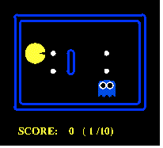

# SDSC8006 Reinforcement Learning Project 

This serves as a code repository for SDSC8006 Reinforcement learning class project. In this project, we will use RL to play a pacman game.

## How to start
For a quick start, to play the game with keyboard, run
```
python pacman.py
```
To use an example agent, run
```
python pacman.py -l smallClassic -p MonteCarloAgent --numTraining 5 --numGames 10 -q
```
To explore more parameters, run
```
$ python pacman.py -h 
```

The main algorithm is implemented in the file RLAgents.py. One can also refer to the https://inst.eecs.berkeley.edu/~cs188/sp21/project2/ for more details. 

## Results

Our tests are implemented in the script `runTest.py`. The results will be stored in figs/ , data/ and gif/.

### results of Q-learning after 1000 games




## Acknowledgement

This project is built on top of the code framework of the link https://inst.eecs.berkeley.edu/~cs188/sp21/project2/ (c.f. LICENSE file). 